<div align="center">



</div>

```js
const developer = { hungry: true, learning: true, building: true, problemSolver: true };
```

## 👋 About Me

Passionate Full Stack Developer who loves turning ideas into real-world solutions. I enjoy
building scalable web applications, solving DSA problems, and picking up new technologies
along the way. Currently exploring System Design and DevOps, and always looking for the next
hard problem to chip away at.

<table>
<tr>
<td align="center" width="25%">🎓<br><b>B.Tech CSE</b><br><sub>Student</sub></td>
<td align="center" width="25%">💻<br><b>Full Stack</b><br><sub>Developer</sub></td>
<td align="center" width="25%">📍<br><b>India</b><br><sub>Based in Punjab</sub></td>
<td align="center" width="25%">🚀<br><b>Open Source</b><br><sub>Contributor</sub></td>
</tr>
</table>

## 🛠️ Tech Stack

<p align="left">

</p>

## 📊 GitHub Stats

<p align="left">


</p>

<p align="left">

</p>

## 📈 GitHub Contribution Graph


## 🟢 LeetCode

<p align="left">

</p>

## 🏆 GitHub Trophies


## 🐍 Contribution Snake

<!--START_SECTION:waka-->
<picture>
  <source media="(prefers-color-scheme: dark)" srcset="https://raw.githubusercontent.com/ankitkumar8340/ankitkumar8340/output/github-contribution-grid-snake-dark.svg" />
  <source media="(prefers-color-scheme: light)" srcset="https://raw.githubusercontent.com/ankitkumar8340/ankitkumar8340/output/github-contribution-grid-snake.svg" />
  
</picture>
<!--END_SECTION:waka-->

> 🐍 Eat commits, stay consistent!

## 🚀 Featured Projects

<p align="left">
<a href="https://github.com/ankitkumar8340/business-card-generator">

</a>
<a href="https://github.com/ankitkumar8340/projectc1">

</a>
</p>
<p align="left">
<a href="https://github.com/ankitkumar8340/activity1">

</a>
<a href="https://github.com/ankitkumar8340/test1">

</a>
</p>

<p align="left"><a href="https://github.com/ankitkumar8340?tab=repositories">View more repositories →</a></p>

## 🌱 Currently Learning
- Data Structures & Algorithms
- System Design
- DevOps & CI/CD
- Docker & Kubernetes

## 📫 Let's Connect
- LinkedIn: [ankitkumar005](https://www.linkedin.com/in/ankitkumar005/)
- Portfolio: [ankitkumar01.vercel.app](https://ankitkumar01.vercel.app/)
- Email: [ankitkumarswe01@gmail.com](mailto:ankitkumarswe01@gmail.com)

## 💬 Random Dev Quote


## 👁️ Profile Views


---

<p align="center">
⭐ From <b>Ankit Kumar</b> with ❤️ &nbsp;&nbsp;|&nbsp;&nbsp; Keep Building. Keep Learning. Keep Growing. 🚀
</p>